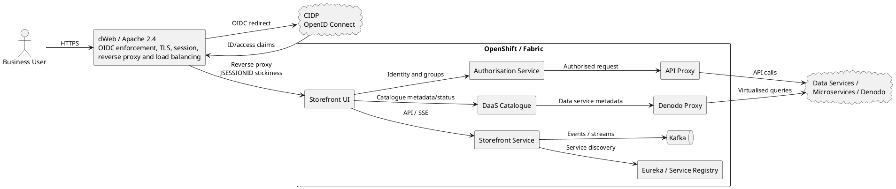
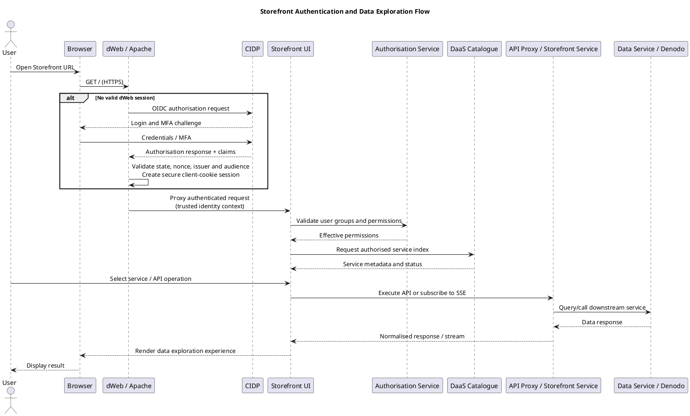

# Storefront DaaS Solution Design Document

**Authentication via CIDP, dWeb reverse proxy, catalogue discovery and data exploration**

> Classification: Internal  
> Status: Draft for architecture review  
> Version: 1.0  
> Prepared: 22 July 2026  
> Owner: TBD - Storefront Product / Technology Owner

## Document control

| Version | Date | Author | Change |
|---|---|---|---|
| 1.0 | 22-Jul-2026 | Architecture draft | Initial consolidated design based on available Storefront artefacts and configuration screenshots |

## Reviewers and approvals

| Role | Name | Status |
|---|---|---|
| Product Owner | TBD | Pending |
| Solution Architect | TBD | Pending |
| Security Architect | TBD | Pending |
| Platform Owner | TBD | Pending |
| Operations / SRE | TBD | Pending |

## Contents

1. [Introduction](#1-introduction)
2. [Dependencies](#2-dependencies-of-programs-or-components)
3. [Functional logic](#3-functional-logic-of-modules--components)
4. [Data model](#4-logical-and-physical-data-model)
5. [Service specifications](#5-service-specifications)
6. [Technical components](#6-technical-component-specifications)
7. [Security and authentication](#7-security-and-authentication)
8. [Integration flows](#8-integration-and-flow-specifications)
9. [Deployment and infrastructure](#9-deployment-and-infrastructure)
10. [Monitoring and support](#10-monitoring-and-operational-support)
11. [Non-functional requirements](#11-non-functional-requirements)
12. [Risks and decisions](#12-risks-assumptions-and-open-decisions)
13. [SDA flow register](#appendix-a---storefront-sda-flow-register)
14. [PlantUML sources](#appendix-b---plantuml-diagram-sources)

# 1. Introduction

## 1.1 Purpose

This document presents the low-level solution design for Storefront DaaS. It consolidates the available architecture diagrams, dWeb configuration, CIDP/OpenID Connect setup, reverse-proxy configuration and intended data-exploration experience. It provides a baseline for implementation, security review, support and future enhancement.

## 1.2 Intended audience

- Project and Product Managers
- Solution and Security Architects
- Frontend and Backend Engineers
- Platform / OpenShift Engineers
- Operations, SRE and Support Teams
- Application and Infrastructure Risk Reviewers

## 1.3 Scope

- User access to Storefront through the enterprise dWeb endpoint.
- Authentication through CIDP using OpenID Connect.
- dWeb session handling, TLS termination, reverse proxying and load balancing.
- Catalogue browsing, service-status inspection, and API/data exploration.
- Integration with Authorisation Service, DaaS Catalogue, Storefront Service, API Proxy, Denodo Proxy, Eureka/service registry and Kafka where applicable.
- Operational monitoring, security controls and high-availability considerations.

## 1.4 Out of scope

- Business logic and data models of individual downstream data services.
- Detailed Denodo virtualisation design and source-system mappings.
- CIDP platform internals and enterprise identity lifecycle management.
- Secrets, passwords, client secrets and private keys. These must never be embedded in this document.

# 2. Dependencies of Programs or Components

| Dependency | Purpose | Criticality |
|---|---|---|
| dWeb / Apache 2.4 | Enterprise entry point, TLS, OIDC, session management, reverse proxy and load balancing | Critical |
| CIDP | Identity provider for OIDC authentication, MFA and claims | Critical |
| Storefront UI | Catalogue browsing and API/data exploration | Critical |
| Storefront Service | Event/data streams and application APIs | High |
| Authorisation Service | User permissions and group-based access | Critical |
| DaaS Catalogue | Service index, status and metadata | Critical |
| API Proxy | Routes API requests to target services | High |
| Denodo Proxy / Denodo | Governed access to virtualised data products | High |
| Eureka / Service Registry | Service discovery and runtime health registration where used | Medium |
| Kafka | Event and streaming integration where used | Medium |
| Fabric / OpenShift | Hosts UI and backend workloads | Critical |

# 3. Functional Logic of Modules / Components

## dWeb

Receives browser traffic, enforces OIDC authentication, creates the authenticated web session and forwards requests to healthy Storefront UI routes.

## Storefront UI

Presents the data-service catalogue, service status and API test experience. Maintains local page state and a global store for current page, navigation link and user identity.

## DaaS Catalogue

Returns a data-service index containing service metadata and status, which drives the Data Services page.

## Translation Layer

Consumes OpenAPI/Swagger definitions and converts heterogeneous API schemas into a normalised model used by the API Test page.

## Storefront Service

Supports EventSource/SSE or API-based data streams used by data-service widgets such as FX and Currency services.

## Authorisation Service

Applies access control using authenticated identity and group claims.

## API Proxy / Denodo Proxy

Routes authorised API/data queries to service backends or Denodo while isolating the browser from internal endpoint details.

## 3.1 User journey

1. The user opens the Storefront URL.
2. dWeb checks for an authenticated session; unauthenticated users are redirected to CIDP.
3. CIDP authenticates the user, including MFA where required, and returns OIDC claims.
4. dWeb establishes a client-cookie session and proxies the request to Storefront UI.
5. Storefront UI retrieves the catalogue and displays services available to the user.
6. The user selects a service and inspects metadata, status, endpoints and parameters.
7. The UI sends an authorised request through the applicable proxy or service.
8. The response is normalised and rendered for exploration.

# 4. Logical and Physical Data Model

Storefront is primarily metadata-driven and does not appear to own a core transactional data store.

| Logical entity | Representative attributes | Source |
|---|---|---|
| User Session | userId/email, groups, session start, expiry | CIDP and dWeb |
| Navigation State | current page, navigation link, selected service | Storefront UI global store |
| Service Catalogue Entry | service name, description, owner, status, links | DaaS Catalogue |
| API Definition | endpoint, method, parameters, request/response schema | OpenAPI/Swagger |
| API Test Request | selected endpoint, parameter values, headers | Storefront UI |
| Normalised API Response | status, headers, structured payload, error details | Translation layer/backend |

No persistent Storefront database has been evidenced. Local reducers and browser state are transient. Any persistence, audit store or catalogue repository must be documented by the owning service.

# 5. Service Specifications

| Service / interface | Consumer | Purpose | Protocol | Authentication |
|---|---|---|---|---|
| Storefront public URL | Browser | Load application | HTTPS | OIDC session via dWeb |
| CIDP OIDC endpoints | dWeb | Authenticate user and obtain claims | HTTPS/OIDC | Enterprise identity + MFA |
| Storefront UI route | dWeb | Serve web UI | HTTPS | Trusted proxy session/header |
| Authorisation API | Storefront components | Validate user entitlements | HTTPS/JSON | Service identity + user context |
| DaaS Catalogue API | Storefront UI/backend | Retrieve service index and status | HTTPS/JSON | Authorised internal access |
| Storefront Service SSE/API | Storefront UI | Receive data stream/service data | HTTPS, SSE/JSON | Authenticated session/token |
| API Proxy | Storefront UI/backend | Route selected API request | HTTPS/JSON | User/service identity |
| Denodo Proxy | Storefront/backend | Query governed virtualised data | HTTPS/JSON | User/service identity |

## 5.1 API design requirements

- OpenAPI/Swagger definitions must be versioned and discoverable.
- All requests should carry a correlation/request ID.
- User identity and effective groups must be propagated only through approved trusted headers or tokens.
- Error responses must use a consistent structure and must not expose stack traces or secrets.
- SSE endpoints must define reconnect, heartbeat, timeout and browser connection-limit behaviour.

# 6. Technical Component Specifications

| Component | Current evidence/configuration | Design requirement |
|---|---|---|
| dWeb site | `dws.storefront.intranet.db.com`; Apache 2.4 | Managed enterprise entry point with TLS and OIDC enabled |
| OIDC | CIDP provider metadata; scopes include `openid`, `email`, `groups` | Store client secret only in protected platform configuration and rotate per policy |
| Session | Client-cookie; inactivity timeout 600 seconds; maximum duration 36000 seconds | Confirm against security policy and user experience |
| Identity header | `CT-REMOTE-USER` populated from email claim | Trust only from dWeb and strip spoofed inbound values |
| Proxy balancer | By request count; JSESSIONID route stickiness | Configure health checks and failover status codes explicitly |
| Backend routes | Two Fabric/OpenShift routes across production clusters | Use HA routing and monitor both targets independently |
| Storefront UI | Fabric/OpenShift deployment | Keep stateless where practical and externalise runtime configuration |
| Catalogue | `daas-catalogue` service | Define availability SLO and cache/fallback behaviour |

# 7. Security and Authentication

## 7.1 Authentication flow

dWeb acts as the relying party and OIDC enforcement point. When no valid dWeb session exists, the browser is redirected to CIDP. Following authentication, dWeb creates a client-cookie session and forwards identity context to Storefront. The application must not independently trust browser-supplied identity headers.

## 7.2 Required controls

- TLS 1.2 or higher for browser, proxy and backend connections.
- OIDC state, nonce, issuer and audience validation.
- Client secrets stored in an approved secret manager or protected dWeb configuration.
- Strict allow-list of unauthenticated endpoints.
- Trusted-proxy enforcement for `CT-REMOTE-USER` and group headers.
- Role/group-based authorisation for each catalogue item and API operation.
- CORS restricted to approved Storefront origins.
- Secure, HttpOnly and SameSite cookie settings.
- Security logging for login success/failure, denied authorisation and privileged API execution.
- Input validation, rate limiting and response-size limits for API test functionality.

## 7.3 Threat considerations

| Threat | Control |
|---|---|
| Header spoofing | Strip identity headers at the edge and inject them only after successful dWeb authentication |
| Open redirect/OIDC manipulation | Allow-list redirect URIs and validate state/nonce |
| Session theft | Secure/HttpOnly/SameSite cookies, short inactivity timeout and reauthentication |
| Unauthorised data discovery | Filter catalogue entries and endpoints using effective user entitlements |
| Backend endpoint exposure | Route through API/Denodo proxy and do not reveal internal service addresses |
| API test abuse | Rate limits, payload limits, method allow-list and full audit trail |
| Secret leakage | Redact credentials from logs and prohibit secrets in UI/config exports |

# 8. Integration and Flow Specifications

| ID | Description | Direction | Protocol | Port | In scope |
|---|---|---|---|---|---|
| SF-01 | User accesses Storefront URL hosted by dWeb | User -> dWeb | HTTPS | 443 | No |
| SF-02 | dWeb redirects unauthenticated user to CIDP | dWeb -> CIDP | HTTPS/OIDC | 443 | No |
| SF-03 | CIDP returns authenticated OIDC response and claims | CIDP -> dWeb | HTTPS/OIDC | 443 | No |
| SF-04 | dWeb establishes session and proxies Storefront request | dWeb -> Storefront UI | HTTPS | 443 | Yes |
| SF-05 | Storefront validates permissions | Storefront -> Authorisation | HTTPS/JSON | 443 | Yes |
| SF-06 | Storefront retrieves service index and status | Storefront -> DaaS Catalogue | HTTPS/JSON | 443 | Yes |
| SF-07 | Catalogue returns service metadata | DaaS Catalogue -> Storefront | HTTPS/JSON | 443 | Yes |
| SF-08 | Storefront subscribes to EventSource/data stream | UI -> Storefront Service | HTTPS/SSE | 443 | Yes |
| SF-09 | Storefront requests selected API | Storefront -> API Proxy | HTTPS/JSON | 443 | Yes |
| SF-10 | API Proxy calls target data service | API Proxy -> Microservice | HTTPS/JSON | 443 | Yes |
| SF-11 | Storefront requests virtualised data | Storefront -> Denodo Proxy | HTTPS/JSON | 443 | Yes |
| SF-12 | Response is returned and rendered | Backend -> Storefront UI | HTTPS/JSON or SSE | 443 | Yes |

# 9. Deployment and Infrastructure

## 9.1 Topology

- Public entry point: `dws.storefront.intranet.db.com` on dWeb/Apache.
- Staging alias: `staging.dws.storefront.intranet.db.com`.
- dWeb reverse-proxy balancer targets two HTTPS Storefront UI OpenShift routes across production Fabric clusters.
- Load balancing is request-count based with JSESSIONID route stickiness.
- Storefront UI and `daas-catalogue` were evidenced as live services in project/instance `dk2326`.

## 9.2 Availability and resilience

- Configure active health checks for both routes; observed health-check and fail-on-status-code settings require review.
- Validate backend connection/read timeouts, including observed 559-second values.
- Avoid server-side session dependency where possible; document sticky-session failover behaviour.
- Deploy at least two replicas per critical service across failure domains.
- Provide graceful degradation when catalogue or optional data services are unavailable.

## 9.3 Configuration management

- Promote dWeb revisions and OpenShift releases through controlled change management.
- Externalise endpoint URLs, OIDC identifiers and feature flags.
- Store secrets in approved secret stores and rotate without rebuilding the application.
- Maintain separate non-production and production configuration with equivalent security controls.

# 10. Monitoring and Operational Support

| Layer | Minimum monitoring |
|---|---|
| dWeb / Apache | Request rate, 4xx/5xx, OIDC failures, backend health, proxy timeout, TLS expiry |
| Storefront UI | Page-load time, JavaScript errors, failed API calls, SSE disconnect/reconnect |
| Storefront Service | Latency, throughput, errors, thread/connection pools, SSE active connections |
| DaaS Catalogue | Availability, response time, stale catalogue age, failed discovery |
| Authorisation | Denied requests, latency and dependency errors |
| API / Denodo Proxy | Upstream latency, status codes, rate-limit events and backend availability |
| OpenShift | Pod availability, restarts, CPU, memory, ingress/route metrics |
| Security | Authentication failures, unusual session activity and unauthorised API attempts |

## 10.1 Logging and tracing

- Use a shared correlation ID from browser entry through proxies and backend services.
- Log privacy-appropriate user identity, action, target service and outcome.
- Centralise logs in Splunk and define dashboards/alerts for critical journeys.
- Do not log tokens, cookies, client secrets, credentials or sensitive payload fields.

## 10.2 Suggested alerts

- Storefront unavailable or greater than 2% 5xx for 5 minutes.
- Both dWeb backend workers unhealthy.
- OIDC authentication failure rate above baseline.
- Catalogue unavailable or stale beyond the agreed threshold.
- SSE disconnect rate or API latency above SLO.
- TLS certificate expiry within 30 days.

# 11. Non-Functional Requirements

| Category | Proposed requirement |
|---|---|
| Availability | Target 99.9% for the Storefront entry point, subject to business confirmation |
| Performance | Initial page load <= 3 seconds p95; catalogue API <= 2 seconds p95 |
| Scalability | Stateless horizontal scaling; proxy capacity sized for peak users and SSE connections |
| Security | Enterprise OIDC, least privilege, TLS, secure session and auditable API access |
| Recoverability | Document RTO/RPO; UI artefacts redeployable from source/repository |
| Maintainability | Versioned APIs, automated build/deploy, external configuration and health endpoints |
| Accessibility | Meet enterprise accessibility standards and WCAG 2.1 AA where applicable |

# 12. Risks, Assumptions and Open Decisions

| Type | Item | Action / owner |
|---|---|---|
| Risk | Proxy health-check and fail-on-status-code settings appear unset | dWeb/platform owner to configure and test failover |
| Risk | Observed backend timeouts are very high | Validate separate connect/read timeout values |
| Risk | Identity is propagated through `CT-REMOTE-USER` | Confirm header stripping, trusted proxy boundary and backend validation |
| Risk | API test capability may provide broad downstream access | Apply endpoint authorisation, method allow-list, limits and audit |
| Assumption | Storefront UI is stateless apart from browser/local reducer state | Confirm with development team |
| Assumption | No Storefront-owned persistent database exists | Confirm catalogue/audit persistence |
| Decision | Browser direct calls versus Storefront Service/API Proxy only | Document final network and token propagation pattern |
| Decision | Whether SSE is required for all or selected services | Define supported patterns and connection limits |
| Decision | Production SLOs and support model | Product and operations sign-off |

# Appendix A - Storefront SDA Flow Register

All flows are internal to DB, on demand, transported over HTTPS on port 443 using Non-IPSec VPN and Internal dbPKI. Component IDs, network zones and certificate identifiers must be completed from the authoritative infrastructure inventory.

| Flow | Description | Direction | Review scope | Format |
|---|---|---|---|---|
| SF-01 | User accesses Storefront URL hosted on dWeb | Downstream | No | HTTPS |
| SF-02 | dWeb redirects user to CIDP | Downstream | No | OIDC |
| SF-03 | CIDP returns authentication response and claims | Upstream | No | OIDC |
| SF-04 | dWeb proxies request to Storefront UI | Downstream | Yes | HTTPS |
| SF-05 | Storefront validates user permissions | Downstream | Yes | JSON |
| SF-06 | Storefront retrieves service catalogue | Downstream | Yes | JSON |
| SF-07 | Catalogue returns services and status | Upstream | Yes | JSON |
| SF-08 | Storefront subscribes to EventSource stream | Downstream | Yes | SSE/JSON |
| SF-09 | Storefront sends API test request to API Proxy | Downstream | Yes | JSON |
| SF-10 | API Proxy forwards request to target service | Downstream | Yes | JSON |
| SF-11 | Storefront queries through Denodo Proxy | Downstream | Yes | JSON |
| SF-12 | Backend response returns to Storefront UI | Upstream | Yes | JSON/SSE |

# Appendix B - PlantUML Diagram Sources

## B.1 Logical Solution Architecture

## B.2 Authentication and Data Exploration Sequence

